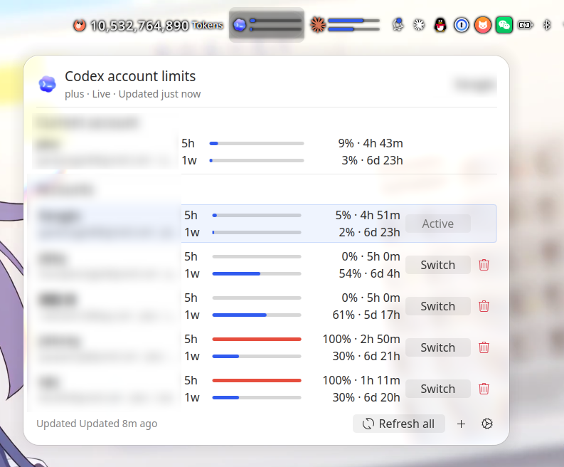

# Codex OAuth Manager

`Codex OAuth Manager` 是一个运行在 `Linux + KDE Plasma 6` 上的 Codex 多账号额度查看与切换组件。  
安装完成后，你需要在 Plasma 小组件列表里添加的实际名称仍然是 `CodexBar Accounts`。

## 预览


_面板状态预览：在 KDE Plasma 面板中快速查看组件的整体效果。_


_折叠状态下的 `CodexBar Accounts` 组件外观。_



_展开后可以查看多个账号的 5 小时 / 1 周额度，并执行刷新、添加账号和切换账号。_

## 适用系统

- `Linux`
- `KDE Plasma 6`
- 已安装 `Rust / Cargo`
- 已安装 `kpackagetool6`
- 已安装并可在终端中运行 `codex`
- 不支持 `Windows` / `macOS` 原生安装

如果你只是想确认依赖是否已就绪，可以先执行：

```bash
cargo --version
kpackagetool6 --version
codex --version
```

## 安装方法

1. 获取仓库源码。

```bash
git clone <仓库地址>
cd codex-usage
```

2. 运行安装脚本。

```bash
bash scripts/install-codexbar.sh
```

3. 安装完成后，在 Plasma 面板空白处右键，打开添加或管理小组件界面，搜索并添加 `CodexBar Accounts`。

4. 后续更新时，重新进入仓库目录执行同一条命令即可：

```bash
bash scripts/install-codexbar.sh
```

安装脚本会编译并安装 `codexbar-collector`、桥接脚本，以及 `CodexBar Accounts` 运行所需组件。

## 使用教程

### 1. 添加小组件

在 KDE Plasma 面板中添加 `CodexBar Accounts`，添加后即可在面板中看到折叠状态的额度条。

### 2. 查看当前账号额度

点击组件后会展开详情面板，你可以看到：

- 当前账号的 `5h` 和 `1w` 使用比例
- 多个账号的额度列表
- 每个账号当前是实时数据还是缓存数据

### 3. 刷新账号额度

在账号列表中点击某一行的刷新按钮，可以单独刷新该账号的额度信息。

点击展开面板右下角的 `Refresh all`，可以立即刷新所有账号的额度信息。

### 4. 添加新账号

点击展开面板右下角的 `+` 按钮，组件会启动终端并执行默认登录命令：

```bash
codex login
```

登录完成后，新账号会出现在账号列表中。

### 5. 切换账号

在账号列表中找到目标账号，点击对应行的 `Switch`，即可将其切换为当前活动账号。

### 6. 删除账号

点击非当前账号右侧的删除按钮，可以把该账号从列表中移除。当前活动账号不会显示可删除状态。

### 7. 按需调整组件配置

右键组件并打开设置后，可以按需修改这些选项：

- `Codex home`：Codex 本地数据目录，默认通常为 `~/.codex`
- `Terminal command`：用于拉起登录终端的命令模板
- `Login command`：默认是 `codex login`
- `Refresh interval`：刷新频率
- `Enable auto switch`：是否启用自动切换账号
- `Auto-switch 5h threshold`：5 小时额度自动切换阈值
- `Auto-switch 1w threshold`：1 周额度自动切换阈值

如果你的系统没有安装 `kitty`，建议先把 `Terminal command` 改成你自己的终端命令模板，例如：

```bash
konsole -e {command}
```

这样点击 `+` 按钮时，组件才能正确拉起登录终端。

## 命令行检查（可选）

如果你想确认采集器是否能正常读取账号额度，可以执行：

```bash
~/.local/bin/codexbar-collector accounts-snapshot --format json --force-refresh
```

能正常输出账号列表和额度信息，通常就说明安装和读取流程已经可用。
